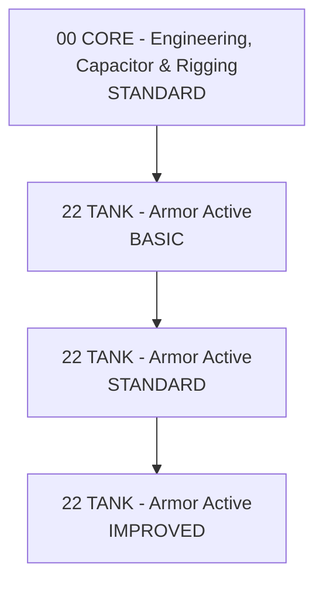

# ARMOR_ACTIVE_DIAGRAM.md

```mermaid
flowchart TD
    A[00 CORE - Engineering, Capacitor & Rigging<br/>STANDARD] --> B[22 TANK - Armor Active<br/>BASIC]
    B --> C[22 TANK - Armor Active<br/>STANDARD]
    C --> D[22 TANK - Armor Active<br/>IMPROVED]
```
