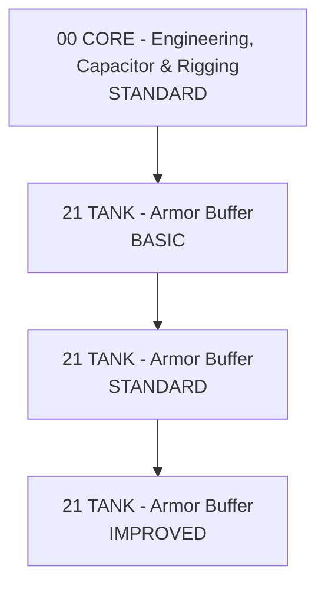

# ARMOR_BUFFER_DIAGRAM.md

## Interpretacja

- `BASIC` = działa i ma pełną bazę armor.
- `STANDARD` = normalny corp poziom.
- `IMPROVED` = dalsze szlifowanie bez automatycznego wciskania wszystkich V.
