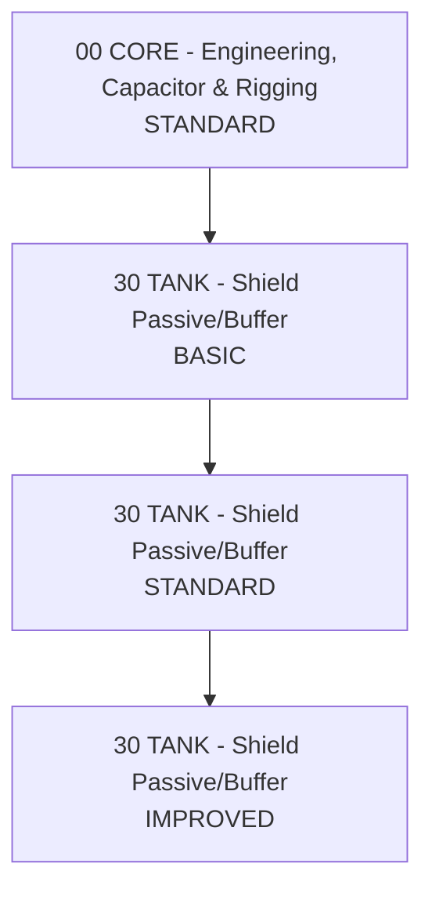

# SHIELD_BUFFER_DIAGRAM.md

```mermaid
flowchart TD
    A[00 CORE - Engineering, Capacitor & Rigging<br/>STANDARD] --> B[30 TANK - Shield Passive/Buffer<br/>BASIC]
    B --> C[30 TANK - Shield Passive/Buffer<br/>STANDARD]
    C --> D[30 TANK - Shield Passive/Buffer<br/>IMPROVED]
```
