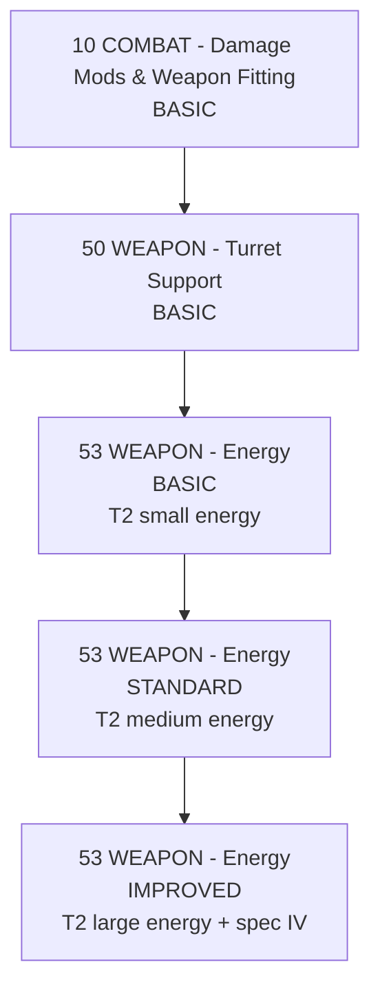

# ENERGY_WEAPONS_DIAGRAM.md

```mermaid
flowchart TD
    A[10 COMBAT - Damage Mods & Weapon Fitting<br/>BASIC] --> B[50 WEAPON - Turret Support<br/>BASIC]
    B --> C[53 WEAPON - Energy<br/>BASIC<br/>T2 small energy]
    C --> D[53 WEAPON - Energy<br/>STANDARD<br/>T2 medium energy]
    D --> E[53 WEAPON - Energy<br/>IMPROVED<br/>T2 large energy + spec IV]
```
