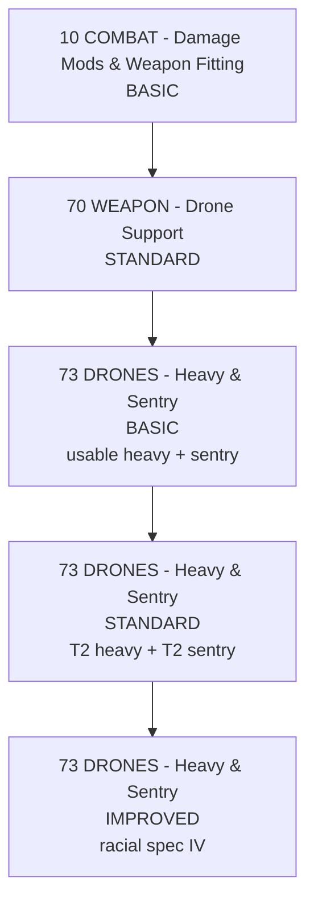

# HEAVY_SENTRY_DRONES_DIAGRAM.md

```mermaid
flowchart TD
    A[10 COMBAT - Damage Mods & Weapon Fitting<br/>BASIC] --> B[70 WEAPON - Drone Support<br/>STANDARD]
    B --> C[73 DRONES - Heavy & Sentry<br/>BASIC<br/>usable heavy + sentry]
    C --> D[73 DRONES - Heavy & Sentry<br/>STANDARD<br/>T2 heavy + T2 sentry]
    D --> E[73 DRONES - Heavy & Sentry<br/>IMPROVED<br/>racial spec IV]
```
