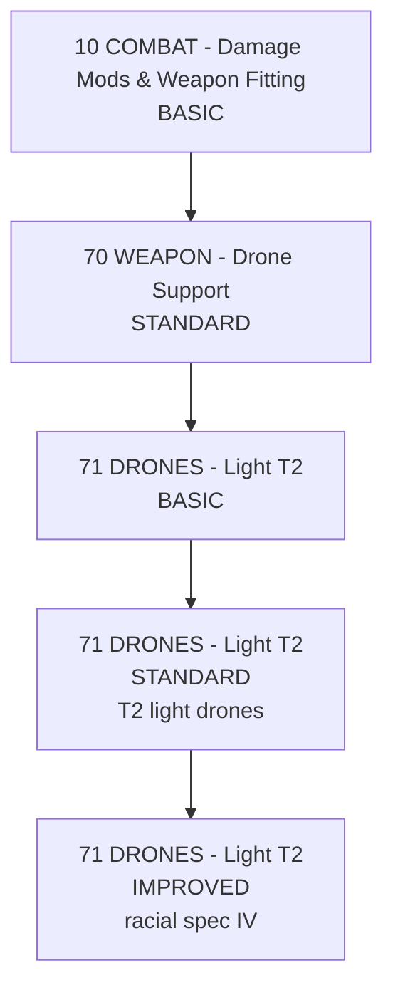

# LIGHT_DRONES_DIAGRAM.md

```mermaid
flowchart TD
    A[10 COMBAT - Damage Mods & Weapon Fitting<br/>BASIC] --> B[70 WEAPON - Drone Support<br/>STANDARD]
    B --> C[71 DRONES - Light T2<br/>BASIC]
    C --> D[71 DRONES - Light T2<br/>STANDARD<br/>T2 light drones]
    D --> E[71 DRONES - Light T2<br/>IMPROVED<br/>racial spec IV]
```
