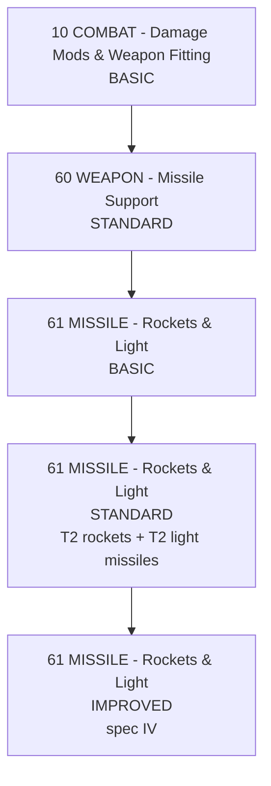

# ROCKETS_LIGHT_MISSILES_DIAGRAM.md

```mermaid
flowchart TD
    A[10 COMBAT - Damage Mods & Weapon Fitting<br/>BASIC] --> B[60 WEAPON - Missile Support<br/>STANDARD]
    B --> C[61 MISSILE - Rockets & Light<br/>BASIC]
    C --> D[61 MISSILE - Rockets & Light<br/>STANDARD<br/>T2 rockets + T2 light missiles]
    D --> E[61 MISSILE - Rockets & Light<br/>IMPROVED<br/>spec IV]
```
