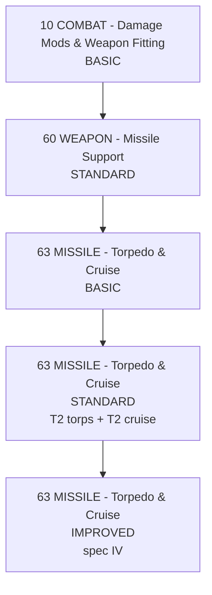

# TORPEDO_CRUISE_MISSILES_DIAGRAM.md

```mermaid
flowchart TD
    A[10 COMBAT - Damage Mods & Weapon Fitting<br/>BASIC] --> B[60 WEAPON - Missile Support<br/>STANDARD]
    B --> C[63 MISSILE - Torpedo & Cruise<br/>BASIC]
    C --> D[63 MISSILE - Torpedo & Cruise<br/>STANDARD<br/>T2 torps + T2 cruise]
    D --> E[63 MISSILE - Torpedo & Cruise<br/>IMPROVED<br/>spec IV]
```
