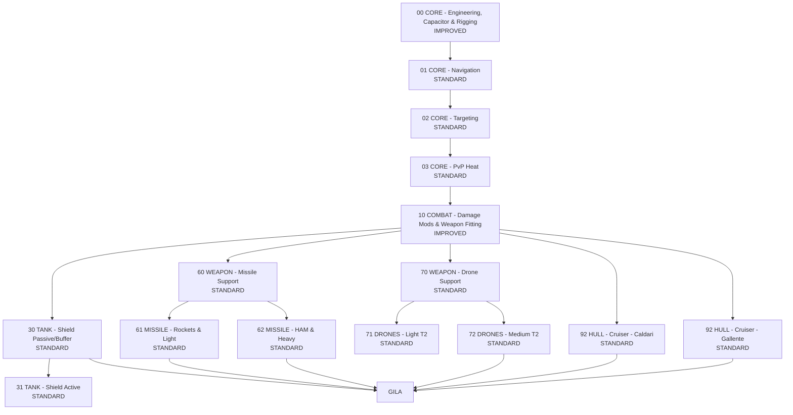
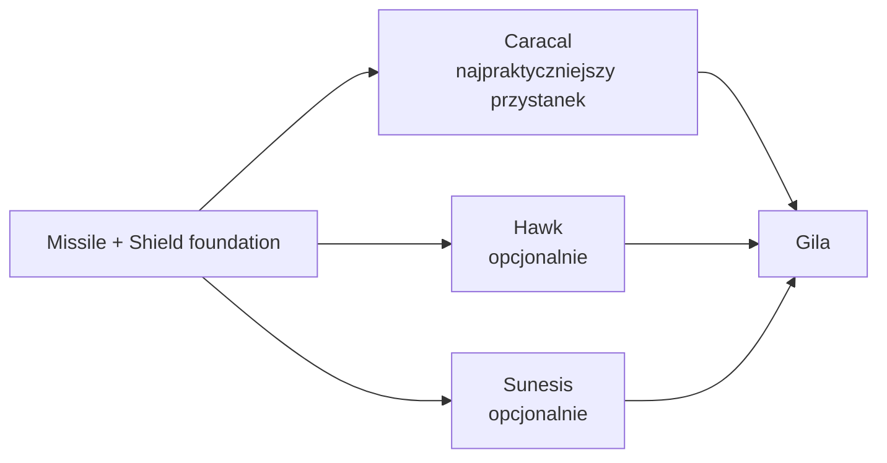

# GILA_SCENARIO_DIAGRAM.md

Oddzielny diagram progresji dla scenariusza Gila.

## Diagram główny

## Opcjonalne odnogi po drodze

## Interpretacja

- **Caracal** to najpraktyczniejszy „formalny” przystanek.
- **Hawk** to ścieżka poboczna dla kogoś, kto chce również bardzo dobry mały missile hull.
- **Sunesis** to wygodny utility side-step, ale nie requirement.
- Prawdziwe serce Gili to:
  - `00 IMPROVED`
  - `30 STANDARD`
  - `60 STANDARD`
  - `70 STANDARD`
  - `72 STANDARD`
  - `92 Caldari STANDARD`
  - `92 Gallente STANDARD`
